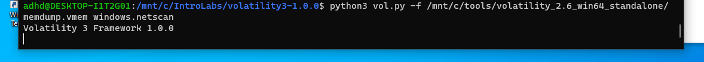
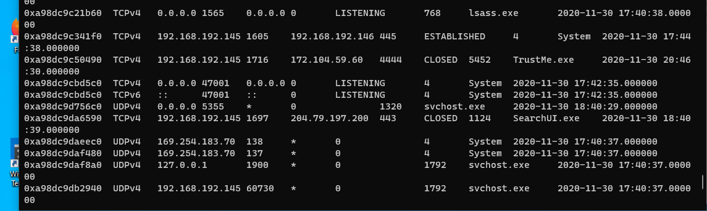
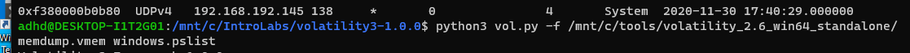
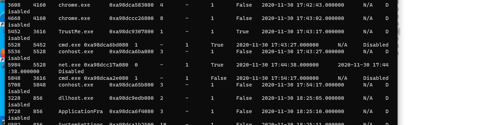
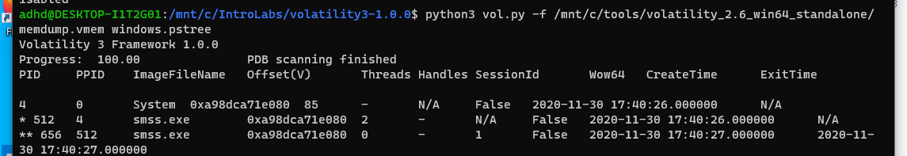

# Volatility

As part of the brilliant Antisyphon training with John Strand, I got to use Volatility to help analyse a memory dump of a compromised system, by looking at the network connections and process information for the malware.

After extracting Volatility, using the code: 

cd /mnt/c/IntroLabs/

tar xvfz ./volatility3-1.0.0.tar.gz

cd volatility3-1.0.0/

We used a netscan command: 

 

 

We found a computer had an established connection to another system and this was unusual.

 

 

Next, we needed to see the processes / process IDs so ran this code:

 

 

The cmd.exe stands out as being unusual for every day user interaction.

 

 

pstree command provided us with more detail:

 

 

Below, you can see that we traced back the parent process for one of the cmd.exe files back to TrustMe.exe. The parent processes helps create a sort of timeline for the processes or actions on the system.

Also, the parent process for TrustMe was Explorer.exe. This means it was invoked by the user on the system, as Explorer.exe is the GUI process for Windows 10.

 

 

Using the dlllist command helped look into the TrustMe.exe process a bit further:

 

 

 

 

Here you can see the dll's associated with the TrustMe process.

We can also see the command line invocation of this process. This is great as it tells us any flags used to start the process and it can tell us where on the system it was executed from.

Finally, let’s look at the easy button with malfind. This module will look at the processes for any suspicious activities.
Hope you enjoyed the walkthrough of the project!
